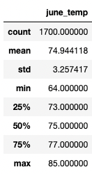
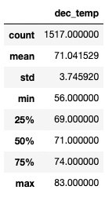

# Surfs_up:
## An Overview of the statistical analysis:
### The purpose:
The purpose of this analysis is to look at the statistical data for the months June and December, to determine if opening an ice cream shop in Oahu would be sustainable year-round. We will do this by collecting all of the data for each month into a filtered list, then make it into a dataframe so we can then look at statisitcal summary. This will be done separetly for the months of June and December.

## Results:

Three key differences in weather between June and December:
- June's average temperature is 74 degrees while Decemner's average temperature is 71 degrees.
- June's minimum temperature is 64 degreees while December's minimum temperature is 56 degrees.
- June's maximum temperature is 85 degrees while December's maximum temperature is 83 degrees.

## Summary:

Based on the summary statisics alone, one could conclude that there is not a lot of temperature variation between the month of June and December. These temperaures seem comparable to other areas in which ice cream shops stay open year round, like San Diego. However, Hawaii in comparison to San Diego get much more rainfall. Rainfall may be a important factor for ice cream customers since traveling in the rain is more difficult and therefore less people venture out of their houses, and customers are less likely to want ice cream when it is raining outside, who likes soggy ice cream? no body. Because of this, I suggest we look more into the precipitation statistics for the months of June and December to help continue to make a proper conclusion to open a ice cream shop in Oahu, Hawaii.
